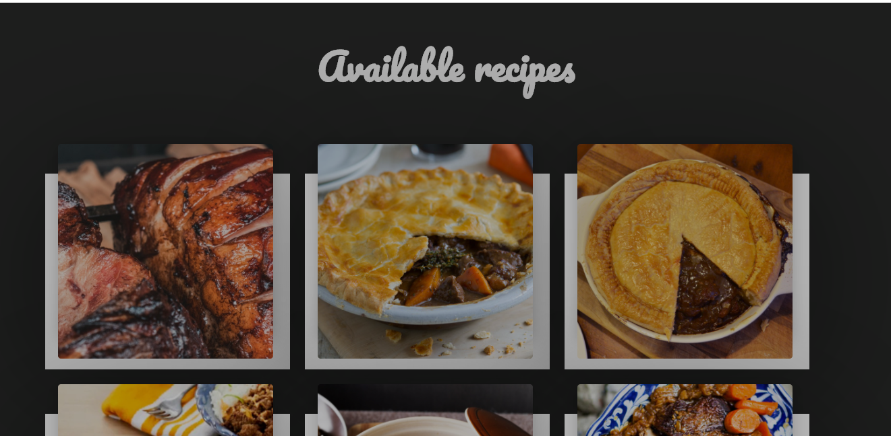

Recipe Catalouge

Clean React-Redux Recipe catalouge which displaces the list of available recipes form mealdb api.
Recipes are displayed upon hover of each recipe card.

Technologies
-React-Redux/javascript/JSX.

Setup
To run the project:

Clone the repository: https://github.com/em-em-D/React-catalouge  Run yarn install. It will install all the dependencies required by the project Run npm start to start the development server. It will automatically open the page in your default browser.

Feel free to contribute if you want to make it better.

Author

Objective
Recipe catalouge is designed to make your search for the perfect meal easy and fun, with its clean and interactive UI. you would find your self lost in your appatitte while surfing through out catalog of recipes.
Up

Technologies Used
Node.js
React
Redux
React-DOM
React-Create-App
yarn
JSX
Styled-Component
ES6
ESlint
Up

Live version
A live version is hosted on Github.

https://em-em-d.github.io/Recipe-catalouge/

Recipe-catalouge @ heroku
How to Install and Run in Your Computer
To run the scripts npm is required. To get npm you have to install Node.js. Follow the installation instructions for your system Mac, Linux or Windows.

Use your terminal and run the commands after each instruction.

Command Description
git clone https://github.com/em-em-D/Recipe-catalouge Clone the repository to you computer
cd react-calculator Navigate to the newly created folder
yarn install Install dependencies and launch browser with examples
yarn start Makes the build and starts the development server
Press Ctrl + c to kill http-server process
http://localhost:3000 Visit this link to use the calculator
Up

Acknowledgements
Microverse software development school
and TSE for the code reviews

👤 Author
Github: @em-em-D
Twitter: @itz_mickymoore
Linkedin: Michael Damulak

🤝 Contributing
Contributions, issues and feature requests are welcome!

Feel free to check the issues page.

Fork it (https://github.com/em-em-D/recipe-catalouge/fork)
Create your feature branch (git checkout -b my-new-feature)
Commit your changes (git commit -am 'Add some feature')
Push to the branch (git push origin my-new-feature)
Create a new Pull Request
Show your support
Give a ⭐️ if you enjoyed this project!

📝 License
This project is MIT licensed.

## MICHAEL.M.DAMULAK

## GITHUB: em-em-D
